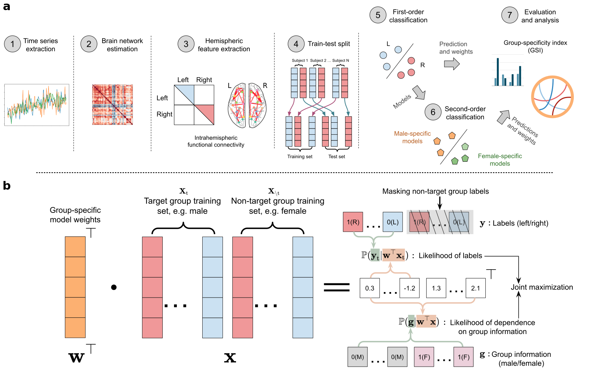

# Group-specific discriminant analysis for modelling sex differences in lateralization of brain functional network

<div align="left">

[](https://colab.research.google.com/github/shuo-zhou/GSDA-Lateralization/blob/main/gsda_demo.ipynb)
[](https://github.com/shuo-zhou/GSDA-Lateralization/blob/main/README.md)
</div>

## Introduction

This repository contains the implementation of Group-Specific Discriminant Analysis (GSDA) for reproducing the results in article: [Group-specific discriminant analysis reveals statistically validated sex differences in lateralization of brain functional network](https://arxiv.org/abs/2404.05781).

## Framework



## Datasets

The resting-state fMRI data from [Human Connectome Project (HCP)](https://www.humanconnectome.org) [[1](#references)] and [Brain Genomics Superstruct Project (GSP)](https://www.neuroinfo.org/gsp/) [[2](#references)] is used in this study. Code for data preprocessing is available at `/preprocess`. Processed data is available at Zenodo: [[HCP](https://doi.org/10.5281/zenodo.10050233)], [[GSP](https://doi.org/10.5281/zenodo.10050234)].

## System Requirements

```(text)
numpy>=1.24.3
pandas>=1.5.3
scipy>=1.10.1
scikit-learn>=1.2.2
pytorch>=2.0.0
yacs
```

## Installation Guide

```(bash)
pip install -r requirements.txt
```

## Instructions for Use

Basic usage:

```(bash)
python main.py --cfg configs/demo-hcp.yaml
```

Please create more .yaml files for different random seeds and datasets.

## Demo

We provide GSDA running demo through a cloud Jupyter notebook on [](https://colab.research.google.com/github/shuo-zhou/GSDA-Lateralization/blob/main/gsda_demo.ipynb). Note the number of repetition is limited for faster demonstrations. This demo takes 10-20 minutes to complete the training and testing process.

## Cite this work

```(bibtex)
@misc{zhou2024groupspecific,
      title={Group-specific discriminant analysis reveals statistically validated sex differences in lateralization of brain functional network},
      author={Shuo Zhou and Junhao Luo and Yaya Jiang and Haolin Wang and Haiping Lu and Gaolang Gong},
      year={2024},
      eprint={2404.05781},
      archivePrefix={arXiv},
      primaryClass={q-bio.NC}
}
```

## References

[1] Smith, S. M. et al. Resting-state fMRI in the human connectome project. _NeuroImage_ 80, 144–168 (2013)

[2] Holmes, A. J. et al. Brain genomics superstruct project initial data release with structural, functional, and behavioral measures. _Sci. Data_ 2, 1–16 (2015)
